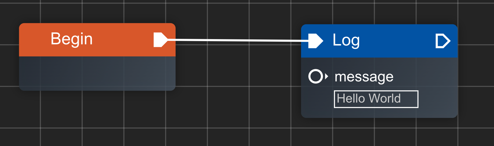
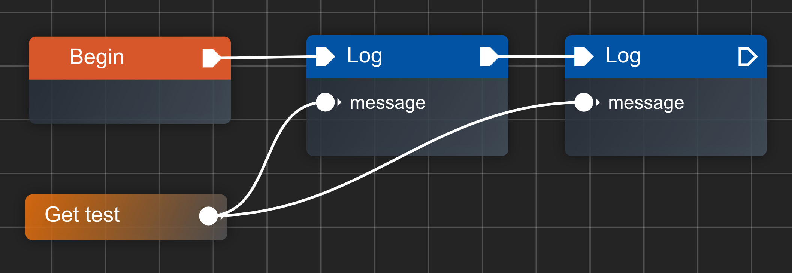

连线是连接节点与节点之间的唯一方式，对于 `执行端点(Exec Pin)` 来说，连线就是执行语句的下一步，对于 `数据端点(Port Pin)` 来说，连线就是变量之间的引用。

连线有几条规则需要遵守:

- **只有不同节点可以连接**: 节点自身不能连接自身
- **只有相同类型的端点可以连接**: 执行端点对执行端点，数据端点对数据端点
- **只有不同方向的端点可以连接**: 连线走向永远是从一个节点的出口到一个节点的入口
- **统一端点的连线数量有约束**
  - 对于执行端点来说，永远最多只能有一条连线，即一对一
  - 对于数据端点来说，输入的连最多只能有一条连线，而输出连线可以有很多

