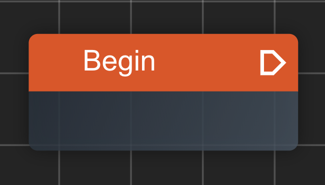

我们先从最简单的节点 `Begin节点` 开始



通过观察可知, `Begin节点` 只有一个输出的执行节点。我们可以看下源代码中是如何定义begin节点的

> 源码路径: src/components/FlowEditor/nodes/definitions/core/begin.tsx

```ts
import { CodeckNodeDefinition } from '@/store/node';
import { DEFAULT_CORE_CATEGORY, STANDARD_PIN_EXEC_OUT } from '@/utils/consts';
import { buildPinPosX, buildPinPosY } from '@/utils/position-helper';
import { BaseNode } from '../../BaseNode';

const width = 150;
const height = 65;

export const BeginNodeDefinition: CodeckNodeDefinition = {
  name: 'begin',
  label: 'Begin',
  type: 'begin',
  component: BaseNode,
  width,
  height,
  category: DEFAULT_CORE_CATEGORY,
  hidden: true,
  inputs: [],
  outputs: [
    {
      name: STANDARD_PIN_EXEC_OUT,
      type: 'exec',
      position: {
        x: buildPinPosX(width, 'output'),
        y: buildPinPosY(0),
      },
    },
  ],
};
```

- name: 定义节点唯一标识为 begin 这个必须是全局唯一的
- label: 定义在视图显示的名称
- type: 节点类型，表示该节点的类型。begin节点比较特殊因此类型就叫begin, 其他的类型有 `'return' | 'function' | 'logic'` 等
- component: 定义渲染样式, BaseNode 是导入的一种渲染预设
- width: 节点宽度为150
- height: 节点高度为65
- category: 节点所在的分组为Core分组(用于右键菜单归类)
- hidden: 节点是否在右键菜单隐藏，这里不希望用户自行创建begin节点，因此设为true(因为begin节点有且只能有一个)
- inputs: 输入端点，这里没有
- outputs: 输出端点，这里只有一个执行端点
  - name: 执行端点唯一名，这个名字必须在**这个节点**上唯一
  - type: 类型是执行端点(exec)还是数据端点(port)
  - position: 端点坐标，这里通过帮助函数算出坐标位置
