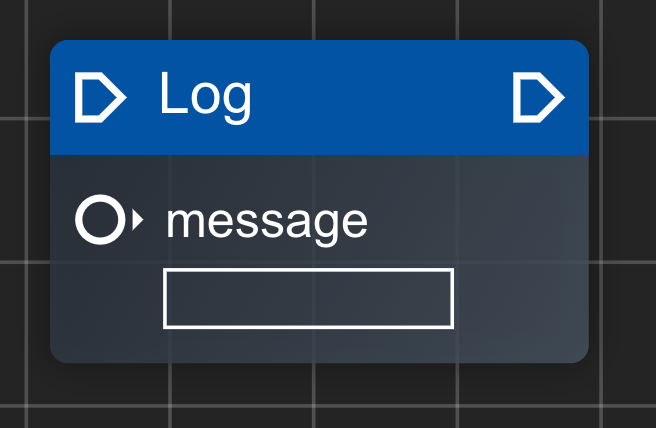

本节我们来看下 `codeck` 是如何生成代码的

我们以 `Log节点` 为例:



`Log节点` 包含一对执行端点输入和输入和一个数据端点输入

> 源码路径: src/components/FlowEditor/nodes/definitions/core/log.tsx

```tsx
import React from 'react';
import { CodeckNodeDefinition } from '@/store/node';
import { BaseNode } from '../../BaseNode';
import {
  DEFAULT_CORE_CATEGORY,
  STANDARD_PIN_EXEC_IN,
  STANDARD_PIN_EXEC_OUT,
} from '@/utils/consts';
import { buildPinPosX, buildPinPosY } from '@/utils/position-helper';
import { TextInputPreset } from '../../components/preset/TextInputPreset';

const width = 150;
const height = 90;

export const LogNodeDefinition: CodeckNodeDefinition = {
  name: 'log',
  label: 'Log',
  type: 'function',
  component: BaseNode,
  width,
  height,
  category: DEFAULT_CORE_CATEGORY,
  inputs: [
    {
      name: STANDARD_PIN_EXEC_IN,
      type: 'exec',
      position: {
        x: buildPinPosX(width, 'input'),
        y: buildPinPosY(0),
      },
    },
    {
      name: 'message',
      type: 'port',
      position: {
        x: buildPinPosX(width, 'input'),
        y: buildPinPosY(1),
      },
      component: ({ nodeId }) => {
        return (
          <TextInputPreset nodeId={nodeId} name="message" label="message" />
        );
      },
    },
  ],
  outputs: [
    {
      name: STANDARD_PIN_EXEC_OUT,
      type: 'exec',
      position: {
        x: buildPinPosX(width, 'output'),
        y: buildPinPosY(0),
      },
    },
  ],
  code: ({ node, getConnectionInput }) => {
    return `console.log(${
      getConnectionInput('message') ?? JSON.stringify(node.data?.message ?? '')
    });\n`;
  },
};
```

我们主要看两部分:
- inputs的component
- code

`inputs`的`component`字段是用于表述这个端点相关的组件渲染函数，这里是渲染了一个 `TextInputPreset`, `TextInputPreset` 的用处是渲染了一个标识(message)和一个可编辑的文本输入框(标识下面的白色方框)

在 `code` 部分是一个函数，用于代码生成，其结构是`(ctx) => string`, 通过上下文导出的帮助函数(`getConnectionInput`)来获取端点相关连线的输入，如果没有获取端点的数据则获取在节点上本身手动输入的数据(`JSON.stringify(node.data?.message ?? '')`)
