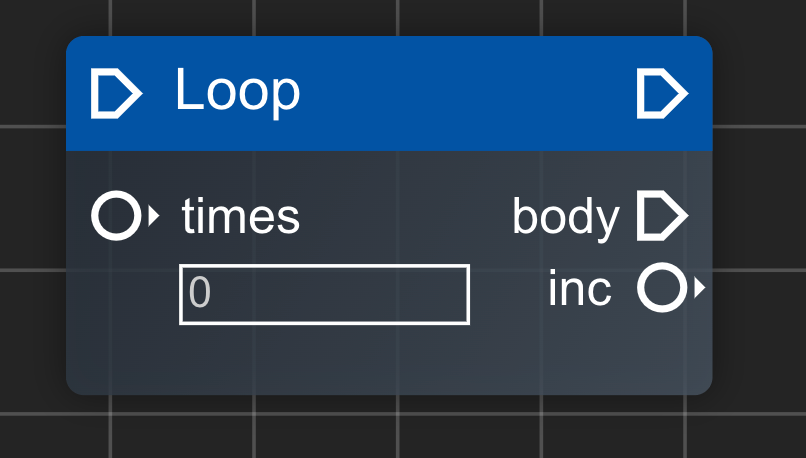

然后我们来看一下一个更加复杂的例子，本节以 `Loop节点` 为例



> 源码路径: src/components/FlowEditor/nodes/definitions/core/loop.tsx

```tsx
import React from 'react';
import { CodeckNodeDefinition } from '@/store/node';
import { BaseNode } from '../../BaseNode';
import {
  DEFAULT_CORE_CATEGORY,
  STANDARD_PIN_EXEC_IN,
  STANDARD_PIN_EXEC_OUT,
} from '@/utils/consts';
import { buildPinPosX, buildPinPosY } from '@/utils/position-helper';
import { NumberInputPreset } from '../../components/preset/NumberInputPreset';
import { PinLabel } from '../../components/pin/Label';

const width = 180;
const height = 100;

export const LoopNodeDefinition: CodeckNodeDefinition = {
  name: 'loop',
  label: 'Loop',
  type: 'function',
  component: BaseNode,
  width,
  height,
  category: DEFAULT_CORE_CATEGORY,
  inputs: [
    {
      name: STANDARD_PIN_EXEC_IN,
      type: 'exec',
      position: {
        x: buildPinPosX(width, 'input'),
        y: buildPinPosY(0),
      },
    },
    {
      name: 'times',
      type: 'port',
      position: {
        x: buildPinPosX(width, 'input'),
        y: buildPinPosY(1),
      },
      component: ({ nodeId }) => {
        return <NumberInputPreset nodeId={nodeId} name="times" label="times" />;
      },
    },
  ],
  outputs: [
    {
      name: STANDARD_PIN_EXEC_OUT,
      type: 'exec',
      position: {
        x: buildPinPosX(width, 'output'),
        y: buildPinPosY(0),
      },
    },
    {
      name: 'body',
      type: 'exec',
      position: {
        x: buildPinPosX(width, 'output'),
        y: buildPinPosY(1),
      },
      component: ({ nodeId }) => {
        return <PinLabel label={'body'} x={-60} />;
      },
    },
    {
      name: 'inc',
      type: 'port',
      position: {
        x: buildPinPosX(width, 'output'),
        y: buildPinPosY(2),
      },
      component: ({ nodeId }) => {
        return <PinLabel label={'inc'} x={-50} />;
      },
    },
  ],
  code: ({
    node,
    buildPinVarName,
    getConnectionInput,
    getConnectionExecOutput,
  }) => {
    const inc = buildPinVarName('inc');
    const times = getConnectionInput('times') ?? node.data?.times ?? 0;

    return `for (let ${inc} = 0; ${inc} < ${times}; ${inc}++) {
  ${
    getConnectionExecOutput('body')?.trim().split('\n').join('\n  ') ?? '' // 为了确保有合适的缩进
  }
}\n`;
  },
};
```

值得注意的是，Loop节点自定义了一个执行端点(Exec Pin)用于描述循环体，在代码生成函数中通过`getConnectionExecOutput('body')`来获取循环体中生成的代码。
